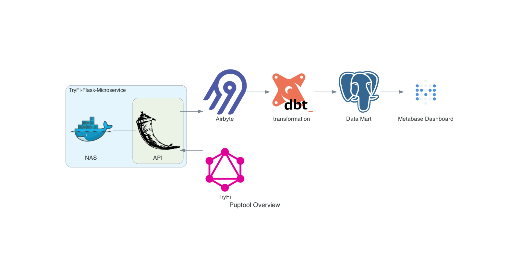

# TryFi Microservice

Flask Microservice to pull data from TryFi GraphQL API utilizing a custom fork of [pyTryFi](https://github.com/ericpark/pytryfi). This is a simple implementation used to get daily data for visualization.

## Installation

Install Docker

Edit the Dockerfile with your username/email and password. 

By default this only returns the first the first pet's steps. 

You can deploy to your localhost running on port 8000 with Docker Compose:
```bash
docker compose up -d
```

Updating the package can be done by uninstalling pytryfi locally before building:
```bash
pip uninstall pytryfi
```

Install the package from the github pytryfi repo:
```bash
pip install git+https://github.com/ericpark/pytryfi.git
```

Freeze the requirements:
```bash
pip freeze > requirements.txt
```

## Usage

```
GET [host]:[port]/steps?days=30
```

Returns a list of steps from the previous 30 days registered by the fidog collar. Default days to returned is 14 and are in EST.


Example cURL:

```bash
 curl localhost:8000/steps
```

Returns a list of steps from the previous 14 days.


## Purpose



The TryFi Microservice used in a simple data pipeline. Airbyte calls the microservice and handles the Extraction and Load into a local data warehouse before transforming with dbt for analysis in Metabase. 

Diagram generated using [Diagrams](https://diagrams.mingrammer.com/)

## Contributing

Pull requests are welcome. For major changes, please open an issue first
to discuss what you would like to change.

Please make sure to update tests as appropriate.

## License

[MIT](https://choosealicense.com/licenses/mit/)